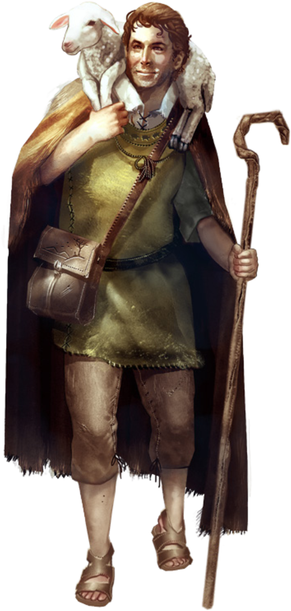
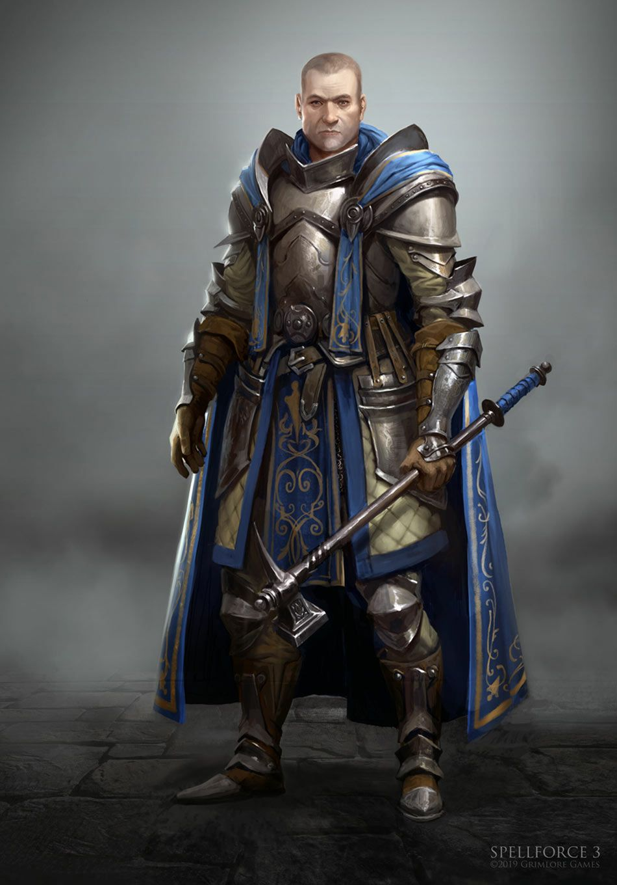
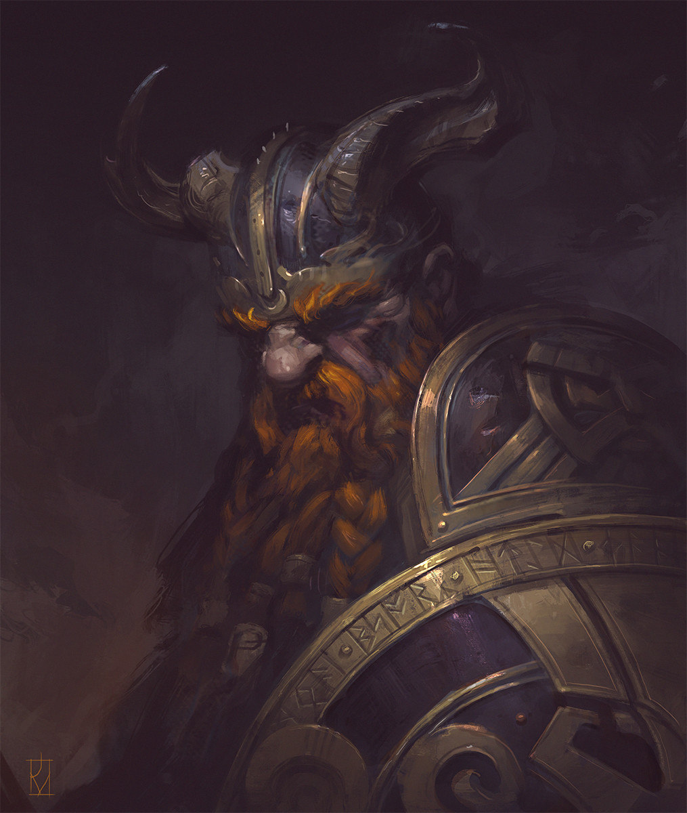
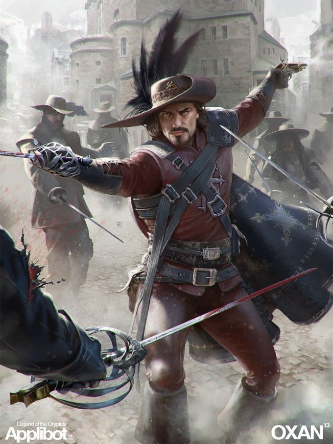
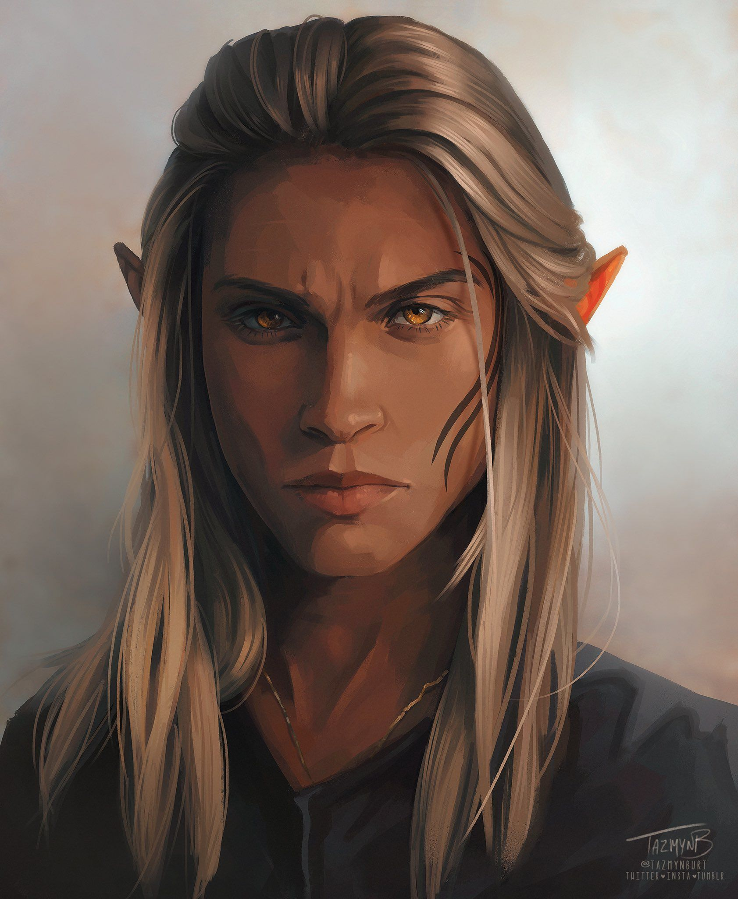

# The Heroes

## Dash, The Cleric

Dash Flechem had planned on following his father's footsteps and be the best sheep herder he could be; one day marrying the cute girl who wove the prettiest cloaks. His kind eyes always warming those he laid his sights on, the village thought him as a strong future leader despite his thin build and strange hair which traders would often poke fun of. However, after being saved by Ampharo's grace, Dash felt he was needed elsewhere in the world. Ampharos had given him a choice and he acted upon it. Now he decided the choice was his and while he often is saddened by what could've been, he set out to spread the love of Ampharos to other villages who need aid and help the downtrodden and forgotten. Maybe one day he would return to his village... Maybe one day.

My God is Ampharos, the God of thunderstorms, lightning, and flocks of sheep. I was raised as a shepherd in the mountain valley village of Ingenstans. They are well known as the lesser of lesser gods among the patheons but to mountain valley villages they are one of the main deities since praying to Ampharos seems to usually work. Village was doing well, I was even to be married but while doing my normal herding I lost a flock to the earth as the ground opened up and closed abruptly after they all fell in. I searched for hours until it was too dark to go back safely. 

Stranded I closed my eyes, knelt, and prayed for the flock and I prayed to survive the night. Lightning struck nearby tossing me like a dirty rag. In the small crater left behind I found a rams horn fashioned into a musical horn. I blew the horn as loud as i could and passed out unexpectedly. When I awoke it was day and the horn was nowhere to be found. All around me lay dead goblins, seemingly prepared to slay me moments before i blew the horn. I walked back to the village to meet up with my flock halfway looking shaken but well. 

I later found out that Ampharos had seen the attack coming and hid my sheep, leaving me the choice to go back home empty handed or to put my trust in Ampharos that all would be well and become a true servant of the Lightning Sheep God. She seems pretty chill so far but has hinted that my destiny is not here but elsewhere. I decided to postpone my marriage after a pilgrimage to spread the love of Ampharos to other small villages in an attempt to lift the God higher on the patheon.

## Bramble, The Druid

Bramble is a weathered halfling druid of Curesh with a dry bark of laugh and speaks in soft rumbles. Adorning his leather armor are plates of bark from fallen trees of his homeland, the leather and wood a memorial and gift from the fauna and flora that he shows guardianship over. His hair is coarse, almost more like a creature's fur, and his glimmering eyes hold an unspoken passion and promise. His nose seems flat and discolored, more resembling the nose of a canid, which matches his sharp toothy grin when he shows one. He claims that it is a gift of the soil, and helps him find the needed herbs and remedies to heal those around him.

He walks with a shillelagh, the wood appearing to  have only strengthened with age and kept in immaculate care. Focusing on healing, he has poultices and herbs, some tied directly to his waist. The items he carries always gives him the faint scent of mint and dried leaves.

He learned Magic in the land of Curesh. Druids from that land are seen as healers of all the world's children, guardians of the sacred balance that keeps the spirit of the earth whole. They are guided by whispers on the wind, leaving their honored posts and their home when they catch word of an imbalance, considering it a summon for their aid.

Abroad, they seek to fix what has become amiss, defend those that plan to cure that imbalance, and spread healing and nature's call in their path. 

This druid heard anguish on the wind and a tremor in the soil, guiding him to seek out what has caused disturbance before he can return home.

### Bonds
- `[          ]` smells more like prey than a hunter.
- The spirits spoke to me of a great danger that follows **Boreas**.
- I have showed **Noah** a secret rite of the land (what?).
- **Gizzur** has tasted my blood and I theirs. We are bound by it.

## The Immolator

Clad in red robes, Boreas has striking looks that stand out in a crowd. His skin is ever so slightly red-tinged, like he has a permanent sunburn, and he has not a single hair on his body, no eyelashes, eyebrows, nosehairs, etc. He holds himself apart from others and looks on with quiet disdain. This facade crumbles when you get him talking about monsters, or the Miasma, or fire, or food, or new places, or new experiences, or a wide variety of things.

Immolators are not born, they are made. A monster broke the village crystal and was carrying off children. A travelling Immolator defeated the monster and instead of asking for payment, he said we must sacrifice something precious of the village. Being the last child alive in the village, I was offered. The Immolator led me to a hidden valley called the Pyre. There I was led into the miasma and subjected to the cleansing fires. I came out changed.

Immolators solve problems and hunt monsters. They are treated much like Witchers, they are needed but feared.

## Darris, The Keeper

A tall, fit, soft-spoken, strong-eyed, man of some 35 years.

He carries himself proudly, but does not act as if he is better than anyone. He follows the law, but encourages, rather than demands, that others do as well. A kind word works better than a closed fist. Empowering others to follow the example of The Peacekeepers, members selected by a power not understood, brings the world more good than returning violence with violence. Despite those ideals, he carries his weapons skillfully, and will not suffer evil to walk the land.

While not averse to simple fun and still in possession of a sense of humor, he often remains outside of merriment, smiling on. "Serious", some would say, though "thoughtful" or "pensive" may be more accurate. 

Member of an order of peace keepers, commonly referred to "keepers". They have historically been given authority to keep the peace across the land. The order picks its own members, often times from pre-adulthood. Its authority mostly lies in historically having that authority - ruling bodies continue that lease because they don't have a reason not to.

### Bonds
- I am often the butt of **Noah's** jokes.
- **Whispers** stole *something* from me.
- **Whispers** and **Noah's** misguided behavior endangers their very souls.
- I respect the beliefs of **Boreas** but hope they will someday see the true way.
- **Dash** is trying to converting me to their faith.

## Noah, The Loremaster

Noah tends to lean towards jolly as his default state of being. On the journey, he'll tell a tale or two to pass the time, when his companions are in the mood for it, and stick his nose in a comically large tome of histories when they're not.

His travel clothes are well worn, but lovingly maintained. As far as physique, he isn't fat... but he's clearly never skipped a meal.

Area of expertise is histories of  bygone civilizations and peoples, gained mostly through swapping stories in roadside inns & remote villages and finding any common threads throughout them that point towards the truth. Novels, journals, and tomes of the history of that era are a welcome but rare find. 

### Bonds
- This is not my first adventure with **Boreas**.
- I told stories of **Gizurr** long before I ever met them in person. He does not think I will survive the tunnels.
-  **Darris** is often the butt of my jokes. He worries about my soul.
- I am writing a novel about the adventures of **Whispers**. We also have a con running in stealing tithings from **Darris'** god.
-  **Bramble** trusted me with a secret, the *rite of the land*.
-   **Dash** does not trust me after I insulted his god. 

## Gizzur, The Slayer

Under hard eyes Gizurr Hávi strides the battlefield. With striking orange hair, bellowing battle cries in his native tongue, smile on his face. His armor is ornate, but battle tested and scarred. His axe... his axe is a thing of greatness standing the height of two dwarfs. It is ancient inscribed with Runes of anger, vengeance, and justice. Despite its age it is still as sharp as the day it was first wielded in battle. Outside of battle Gizurr dresses in bright colors, he smiles often and laughs hard, loving nothing more than to live each day as if it is his last.

>My honor is my life and without it I am nothing. I shall become a Slayer. I shall seek redemption in the eyes of my ancestors. I shall become as death to my enemies, until I face he that takes my life and my shame. I have made a pilgrimage to the holy Shrine of Grimnir and I have cut my name upon the pillar, where the names of many other Slayers have been carved over the millennium. Thus I take The Slayer's Oath.

>Baruk Khazâd! Khazâd ai-mênu! Axes of the Dwarves! The Dwarves are upon you!

### Bonds

- **Boreas** owes me their life, whether they admit it or not.
- I have sworn to protect **Dash**.
- I worry about the ability of **Noah** to survive in the dungeon.
- **Darrius** is soft, but I will make them hard like me.

## Whispers, The Thief

Though he would prefer to think or talk his way out of a fight, Whispers is handy with a rapier to poke his way out of a situation (he's not above using his "rapier" to "poke" his way out of a situation too). Amiable & easygoing, he's easy to forgive as long as it's "fair play." That said, he always keeps an eye on the exits, and avoids making eye contact unless he needs to turn on the charm. He's always found that the easiest way to avoid getting caught is to pretend like he belongs there.

Whispers learned his trade growing up among the guttersnipes, whores, rakes, and dissolute nobles of Paviedo, a city functionally ran by an elected body from the great houses. The chaotic, backstabbing internal politics and mercantile wealth that flow through the city creates an ideal crucible for an enterprising person to learn how to steal almost anything in almost any way. Whispers has learned that sometimes the most valuable, and most risky, things to steal are secrets; though as an enterprising guy he'll swipe anything he thinks he can get away with. Whispers has spent years mastering the application of Goldenroot, of which he has learned to forage for and prepare. He's always avoided membership in thieves guilds, preferring to take jobs directly from the banking houses or work on spec. Even if he doesn't have a buyer lined up, there's always someone interested in a secret.

## Ereshkael, The Wizard

Ereshkael is a tall, stylish practitioner of the arcane arts, trying to do good in the world. Ereshkael was banished from his junior position on the Elven Council for disrupting a meeting where a unanimous decision was made to allow a smaller village to burn in order to safeguard the Council. With his research in hand, he travels to far away lands to do what the council would not, help those who need it. Ereshkael is always in pursuit of ways to empower himself in order to serve as a greater bulwark to those who are powerless to defend themselves.

Dash will play an important role in the events to come. The research is irrefutable.
Gizurr is woefully misinformed about the world, I will teach him all I can.

### Bonds

- **Dash** will play an important role in the events to come. I have foreseen it!
- `[        ]` is keeping an important secret from me.
- **Gizurr** is woefully misinformed about the world; I will teach them all that I can